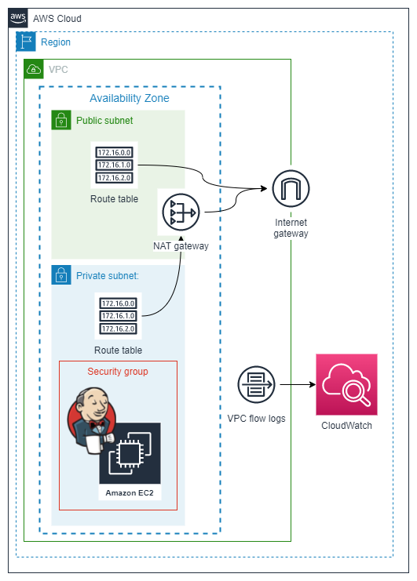

# Jenkins deployment on EC2 using Terraform and Ansible-Pull

With this terraform template, you will be able to deploy an EC2 instance and install Jenkins on it. To achieve the automatic installation of Jenkins, I am using [my jenkins-ansible-pull repository.](https://github.com/JManzur/jenkins-ansible-pull)

This template also deploy a Demo VPC. 

⚠️ The EC2 instance will be place on a private subnet, so to access the Jenkins portal you will need a direct connection to the subnet through a VPN or Amazon Workspace.

>💡**Pro tip**: You can use a bastion hosts and create an ssh tunnel using "SSH Dynamic Port Forwarding" to access the Jenkins portal. [Learn more.](https://github.com/JManzur/ec2-bastion-host)

### Deployment diagram:



## Tested with: 

| Environment | Application | Version  |
| ----------------- |-----------|---------|
| WSL2 Ubuntu 20.04 | terraform | v1.1.4  |
| WSL2 Ubuntu 20.04 | aws-cli | 2.2.12  |

## Initialization How-To:

Located in the root directory, make an "aws configure" to log into the aws account, and a "terraform init" to download the necessary modules and start the backend.

```bash
aws configure
terraform init
```

Generate a Key-Pair using AWS-CLI:

```bash
aws ec2 create-key-pair --key-name Jenkins-DEMO --query 'KeyMaterial' --output text > Jenkins-DEMO.pem
```

>:warning: if you use a different key name, change the variable "key_name" in the variables.tf file

Change permissions:
```bash
chmod 400 Jenkins-DEMO.pem
```

Move to home folder:
```bash
mv Jenkins-DEMO.pem ~/.ssh/Jenkins-DEMO.pem
```

>:warning: if you choose a different location, change the variable "local_ssh_key" in the variables.tf file

## Deployment How-To:

Located in the root directory, make the necessary changes in the variables.tf file and run the manifests:

```bash
terraform apply
```

## Author:

- [@jmanzur](https://github.com/JManzur)

## Documentation:

- [Jenkins Official Site](https://www.jenkins.io/)
- [Jenkins Handbook](https://www.jenkins.io/doc/book/)